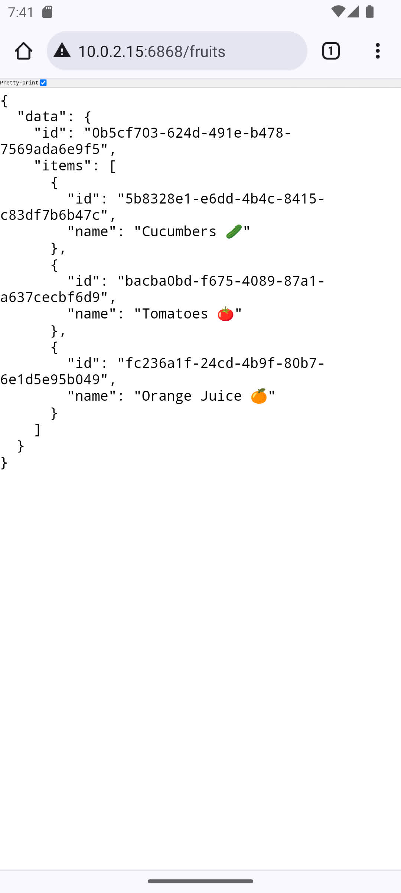
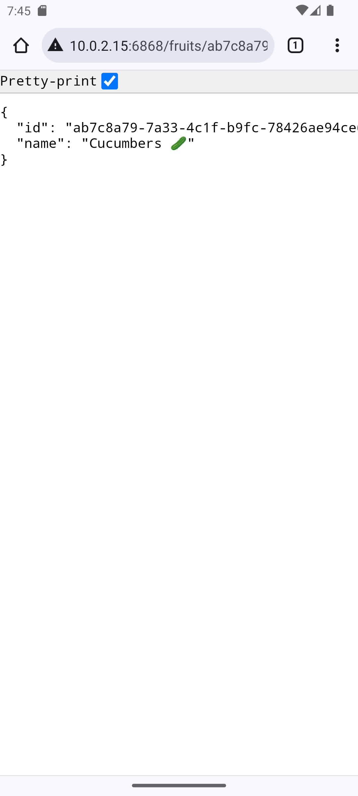

# Kotlin Embedded Server

<div align="center">


</div>

---

## About

A powerful, lightweight HTTP server framework designed specifically for Android applications using Kotlin. Transform your Android device into a fully functional web server with minimal setup and maximum performance.

Perfect for:
- Local development environments
- IoT device communication
- Data synchronization between devices
- Prototyping and testing
- Peer-to-peer applications

---

## Key Features

- Lightweight & Fast - Minimal footprint with optimal performance
- Easy Integration - Simple API with Kotlin coroutines support
- Cross-Platform - Works on all Android devices (API 21+)
- RESTful APIs - Built-in support for REST endpoints
- WebSocket Support - Real-time bidirectional communication
- Static File Serving - Serve static resources effortlessly
- Secure - Built with security best practices
- Type-Safe - Full Kotlin type safety and null safety

---

## Quick Start

### Installation

Clone the repository and start building:

```bash
git clone https://github.com/shubham230523/KotlinEmbeddedServer.git
cd KotlinEmbeddedServer
```

### Basic Usage

Create a simple HTTP server in just a few lines:

```kotlin
embeddedServer(Netty, port = 8080) {
    install(WebSockets)
    install(CallLogging)
    install(ContentNegotiation) {
        json()
    }
    
    routing {
        get("/") {
            call.respondText(
                text = " Welcome to Kotlin Embedded Server on ${Build.MODEL}!",
                contentType = ContentType.Text.Plain
            )
        }
        
        get("/api/status") {
            call.respond(mapOf(
                "status" to "running",
                "device" to Build.MODEL,
                "version" to Build.VERSION.RELEASE
            ))
        }
    }
}.start(wait = false)
```

---

## Architecture

```
┌─────────────────────────────────────┐
│           Android App               │
├─────────────────────────────────────┤
│        Kotlin Embedded Server       │
├─────────────────────────────────────┤
│  ┌─────────────┐  ┌─────────────┐   │
│  │   Ktor      │  │  Netty      │   │
│  │   Engine    │  │  Engine     │   │
│  └─────────────┘  └─────────────┘   │
├─────────────────────────────────────┤
│           Android OS                │
└─────────────────────────────────────┘
```

---

## Advanced Features

### Static Resources

Serve static files with ease:

```kotlin
staticResources("/static", "assets") {
    default("index.html")
}
```

### WebSocket Support

Real-time communication made simple:

```kotlin
webSocket("/chat") {
    for (frame in incoming) {
        when (frame) {
            is Frame.Text -> {
                val text = frame.readText()
                send(Frame.Text("Echo: $text"))
            }
        }
    }
}
```

### Database Integration

Built-in database support for data persistence:

```kotlin
get("/api/fruits") {
    call.respond(Database.getAllFruits())
}

post("/api/cart") {
    val cart = call.receive<Cart>()
    Database.saveCart(cart)
    call.respond(HttpStatusCode.Created, cart)
}
```

---

## UI Components

Beautiful, responsive UI components included:

- Animated Logo - Smooth loading animations
- Responsive Design - Works on all screen sizes
- Material Design - Modern, clean interface
- Performance Optimized - Smooth 60fps animations

---

## Screenshots

<div align="center">

| Home Screen | API Response | Static Content |
|-------------|--------------|----------------|
|  |  |  |

</div>

---

## Tech Stack

- Language: Kotlin 1.9.23
- Framework: Ktor
- Engine: Netty
- Build Tool: Gradle 8.3.2
- UI: Android Jetpack Compose
- Database: Room (optional)
- Serialization: Kotlinx Serialization

---

## Requirements

- Android Studio Arctic Fox or later
- Android SDK API 21+ (Android 5.0)
- Kotlin 1.9.23+
- Gradle 8.3.2+

---

## Configuration

Customize your server with these configuration options:

```kotlin
embeddedServer(Netty, port = 8080, host = "0.0.0.0") {
    // Configure modules
    install(WebSockets) {
        pingPeriod = Duration.ofSeconds(15)
        timeout = Duration.ofSeconds(15)
    }
    
    install(CallLogging) {
        level = LogLevel.INFO
        filter { call -> call.request.path().startsWith("/") }
    }
}
```

---

## Contributing

We welcome contributions! Here's how you can help:

1. Fork the repository
2. Create a feature branch (`git checkout -b feature/amazing-feature`)
3. Commit your changes (`git commit -m 'Add amazing feature'`)
4. Push to the branch (`git push origin feature/amazing-feature`)
5. Open a Pull Request

---

## License

This project is licensed under the Apache License 2.0 - see the [LICENSE](LICENSE) file for details.